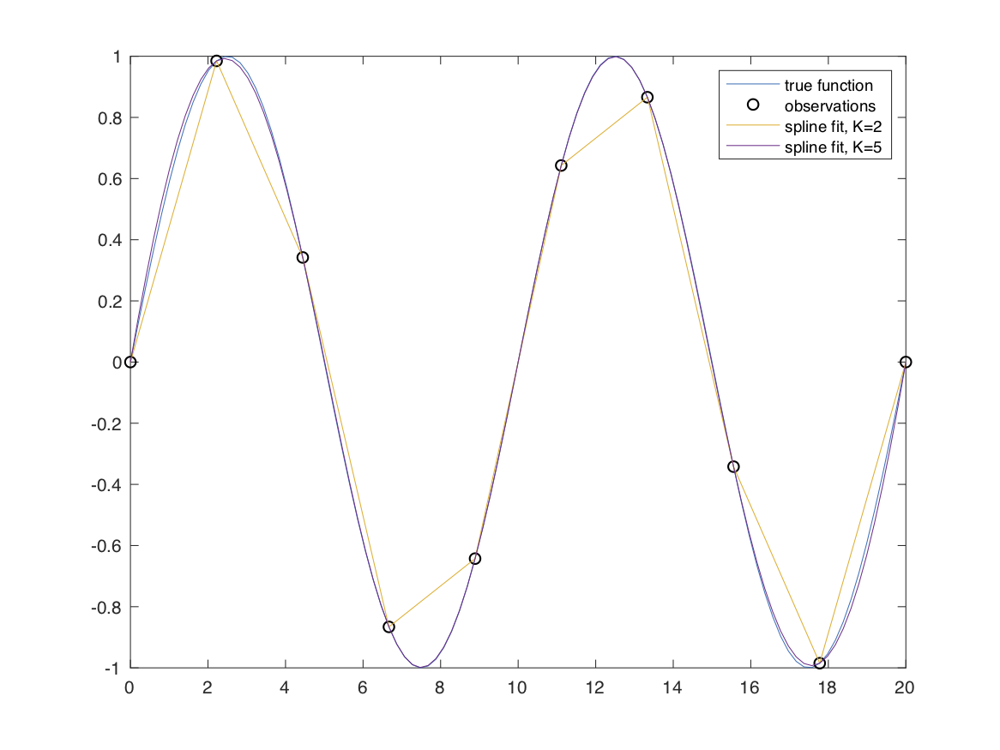

# Getting Started

This tutorial demonstrates the basic usage of the spline classes, from
explicit basis construction through noisy-data fitting in one and multiple
dimensions.

## Initialization

The `BSpline` class constructs and evaluates a spline basis once you specify
the order, terminated knot sequence, and spline coefficients.

```matlab
K = 4;
t = (0:10)';
tKnot = [repmat(t(1),K-1,1); t; repmat(t(end),K-1,1)];
xi = zeros(numel(tKnot)-K,1);
xi(4) = 1;

spline = BSpline(K,tKnot,xi);
```

You can now evaluate the spline and its derivatives using function-call
syntax,

```matlab
spline(5.5)
spline(5.5,1)
```

## Interpolating splines

For interpolation problems, `InterpolatingSpline` chooses an appropriate
terminated knot sequence from the sample locations and solves for the spline
coefficients directly.

```matlab
x = linspace(0,20,10)';
y = sin(2*pi*x/10);
f = InterpolatingSpline(x,y);
```

The interpolated spline can then be evaluated on a denser grid for plotting
or analysis,

```matlab
xDense = linspace(0,20,200)';
yDense = f(xDense);

figure
plot(xDense,yDense,"LineWidth",2), hold on
scatter(x,y,"filled")
legend("InterpolatingSpline","Samples")
```



## Constrained fits

`ConstrainedSpline` extends the same idea to noisy fitting. In one
dimension it is intended to feel like the fitting counterpart to
`InterpolatingSpline`: you can pass a sample vector directly, let the class
choose knots from the data, and then add local or global constraints when
needed.

```matlab
t = linspace(0,1,50)';
x = exp(t) + 0.05*randn(size(t));
fit = ConstrainedSpline(t, x, ...
    K=4, ...
    dataDOF=2, ...
    constraints=GlobalConstraint.monotonicIncreasing());
```

The class documentation provides the full method-level reference for basis
construction, evaluation, constrained fitting, and shape constraints.

If you want `ConstrainedSpline` to reduce to the same least-squares
polynomial fit as `polyfit(t,x,N-1)`, use `K=N` and `splineDOF=N`. For
example, `K=4, splineDOF=4` gives the cubic least-squares fit.

## Tensor-product splines

`TensorSpline` and `InterpolatingSpline` extend the same ideas to
rectilinear grids in multiple dimensions.

```matlab
x = linspace(-1,1,6)';
y = linspace(0,2,7)';
[X,Y] = ndgrid(x,y);
F = X.^2 .* Y.^3 + 2*X.*Y - 5;

tensorSpline = InterpolatingSpline(x, y, F, K=[4 4]);
Fq = tensorSpline(X, Y);
```

The tensor classes support mixed partial derivatives as well, for example
`tensorSpline(X, Y, [1 0])` for the derivative with respect to the first
dimension.

## Tensor-product fitting with noisy data

`ConstrainedSpline` fits a tensor-product spline to noisy observations.
With the current default settings it chooses a cubic spline in each
dimension, chooses knot vectors from the observed coordinate values, and
assumes unit Gaussian errors.

```matlab
x = linspace(-1,1,6)';
y = linspace(-2,2,7)';
[X,Y] = ndgrid(x,y);

Ftrue = 1 + 2*X - Y + 0.5*X.^2.*Y - 0.25*X.*Y.^3;
Fobs = Ftrue + 0.05*randn(size(Ftrue));

fit = ConstrainedSpline({X,Y}, Fobs);

xq = linspace(min(x),max(x),41)';
yq = linspace(min(y),max(y),51)';
[Xq,Yq] = ndgrid(xq,yq);
Fq = fit(Xq, Yq);
```

If you want a denser tensor basis or a robust error model, pass them as
named options.

```matlab
fit = ConstrainedSpline({X,Y}, Fobs, ...
    K=[4 4], ...
    tKnot={BSpline.knotPointsForDataPoints(x,K=4,dataDOF=2), ...
           BSpline.knotPointsForDataPoints(y,K=4,dataDOF=2)}, ...
    distribution=StudentTDistribution(sigma=0.05,nu=3));
```

Use the `constraints` option to pass any mix of `PointConstraint` and
`GlobalConstraint` objects.
