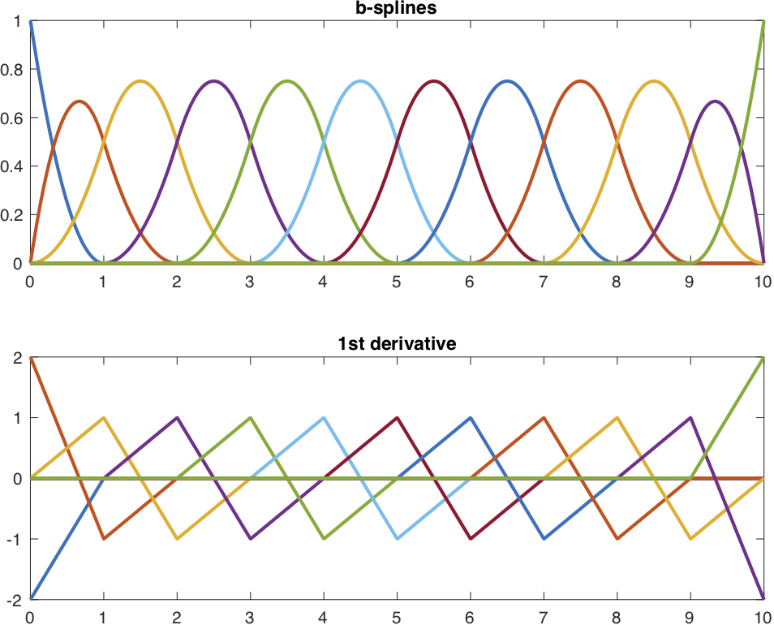

# Spline Core
## Core B-spline, interpolation, and constrained fitting classes for MATLAB.

- [Install](installation) the Matlab package
- Read the [Getting Started](getting-started) guide
- Dive deeper into the [class documentation](classes/bspline/)

---

`Spline Core` centers on the `BSpline` basis representation and builds
interpolation and constrained fitting tools on top of it. The package is
intended for spline construction, evaluation, differentiation, integration,
constrained regression workflows, tensor-product interpolation on
rectilinear grids, and tensor-product fitting for noisy gridded data.

The figure below shows a terminated B-spline basis generated from a knot
sequence and evaluated on a dense grid.



The same basis can be created with a few lines of code,
```matlab
K = 4;
t = (0:10)';
tKnot = [repmat(t(1),K-1,1); t; repmat(t(end),K-1,1)];
xi = zeros(numel(tKnot)-K,1);
xi(4) = 1;

spline = BSpline(K,tKnot,xi);
tDense = linspace(t(1),t(end),500)';
plot(tDense,spline(tDense),"LineWidth",2)
```
