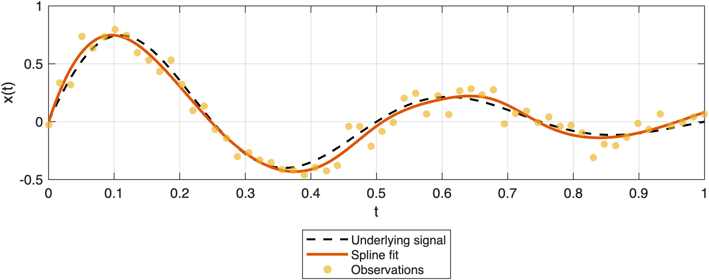
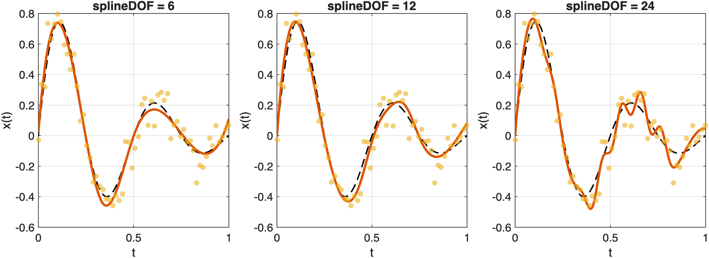

# Fitting Noisy Data

Fit a smooth spline to noisy observations with a normal noise model and explore the effect of spline complexity.

Source: `Examples/Tutorials/FittingNoisyData.m`

## Fit noisy observations with a normal noise model

`ConstrainedSpline` is the fitting counterpart to `InterpolatingSpline`.
Instead of matching every observation exactly, it treats the samples as
noisy measurements of an underlying smooth signal.

$$
y_i = f(t_i) + \epsilon_i, \qquad \epsilon_i \sim \mathcal{N}(0,\sigma^2).
$$

```matlab
rng(5)
t = linspace(0, 1, 60)';
xTrue = exp(-2.5*t).*sin(4*pi*t);
xObs = xTrue + 0.08*randn(size(t));
tq = linspace(t(1), t(end), 400)';

noiseModel = NormalDistribution(0.08);
fit = ConstrainedSpline(t, xObs, S=3, splineDOF=12, distribution=noiseModel);
xFit = fit(tq);
```

Plot the fitted curve against the noisy observations.

```matlab
figure(Position=[100 100 820 320])
plot(tq, exp(-2.5*tq).*sin(4*pi*tq), "k--", LineWidth=1.5), hold on
plot(tq, xFit, LineWidth=2)
scatter(t, xObs, 28, "filled", MarkerFaceAlpha=0.65)
xlabel("t")
ylabel("x(t)")
legend("Underlying signal", "Spline fit", "Observations", Location="southoutside")
grid on
```



*ConstrainedSpline fits a smooth curve to noisy observations under a normal noise model.*

## Change splineDOF to change complexity

The `splineDOF` option is the main knob for how much structure the spline
can use. Smaller values force a smoother, lower-complexity fit, while
larger values allow more local variation.

```matlab
splineDOF = [6 12 24];
fits = cell(size(splineDOF));
for iFit = 1:numel(splineDOF)
    fits{iFit} = ConstrainedSpline(t, xObs, S=3, splineDOF=splineDOF(iFit), distribution=noiseModel);
end
```

Compare how splineDOF changes the complexity of the fit.

```matlab
figure(Position=[100 100 980 320])
tiledlayout(1, 3, TileSpacing="compact")

for iFit = 1:numel(fits)
    nexttile
    plot(tq, exp(-2.5*tq).*sin(4*pi*tq), "k--", LineWidth=1.2), hold on
    plot(tq, fits{iFit}(tq), LineWidth=2)
    scatter(t, xObs, 20, "filled", MarkerFaceAlpha=0.6)
    title(sprintf("splineDOF = %d", splineDOF(iFit)))
    xlabel("t")
    ylabel("x(t)")
    grid on
end
```



*Changing splineDOF moves the fit from underfit to a good compromise and then toward a more flexible, higher-variance fit.*

