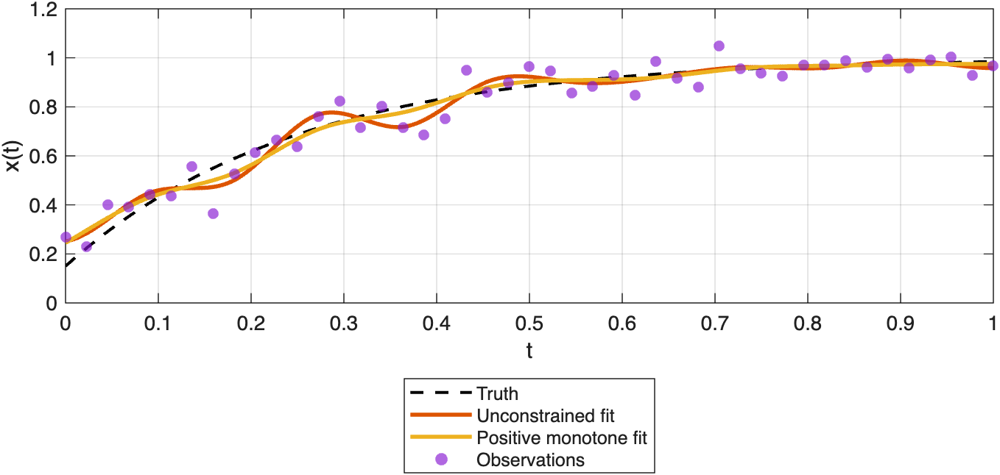
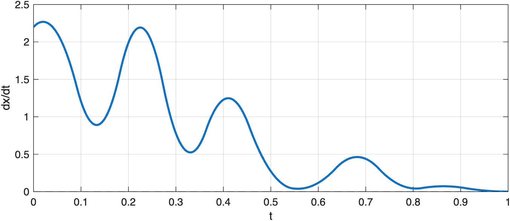

# Global Shape Constraints

Enforce positivity and monotonicity over an entire domain with GlobalConstraint objects.

Source: `Examples/Tutorials/GlobalShapeConstraints.m`

## Fit a monotone nonnegative profile

Global constraints apply to the whole fitted spline rather than a few
selected points. In one dimension, positivity and monotonicity are often
the simplest way to keep a fit physically meaningful.

```matlab
rng(4)
t = linspace(0, 1, 45)';
xTrue = 0.15 + 0.85*(1 - exp(-4*t));
xObs = xTrue + 0.05*randn(size(t));
xObs([8 18 31]) = xObs([8 18 31]) - [0.09; 0.12; 0.07];

tKnot = linspace(min(t), max(t), 12)';

freeFit = ConstrainedTensorSpline(t, xObs, K=4, tKnot={tKnot});
shapeConstrainedFit = ConstrainedTensorSpline(t, xObs, K=4, tKnot={tKnot}, ...
    globalConstraints=[ ...
        GlobalConstraint.positive()
        GlobalConstraint.monotonicIncreasing()]);

tDense = linspace(min(t), max(t), 400)';
xTrueDense = 0.15 + 0.85*(1 - exp(-4*tDense));
xFree = freeFit(tDense);
xShapeConstrained = shapeConstrainedFit(tDense);

figure(Position=[100 100 780 360])
plot(tDense, xTrueDense, "k--", LineWidth=1.5), hold on
plot(tDense, xFree, LineWidth=2)
plot(tDense, xShapeConstrained, LineWidth=2)
scatter(t, xObs, 28, "filled", MarkerFaceAlpha=0.65)
xlabel("t")
ylabel("x(t)")
legend("Truth", "Unconstrained fit", "Positive monotone fit", "Observations", ...
    Location="southoutside")
grid on
```



*GlobalConstraint objects enforce whole-domain positivity and monotonicity in a single fit.*

## Check the fitted derivative

Once the global monotonicity constraint is active, the first derivative is
nonnegative throughout the fitted interval.

```matlab
dShapeConstrained = shapeConstrainedFit(tDense, 1);

figure(Position=[100 100 780 300])
plot(tDense, dShapeConstrained, LineWidth=2)
yline(0, "k--")
xlabel("t")
ylabel("dx/dt")
grid on
```



*The derivative of the constrained fit stays nonnegative across the domain.*

