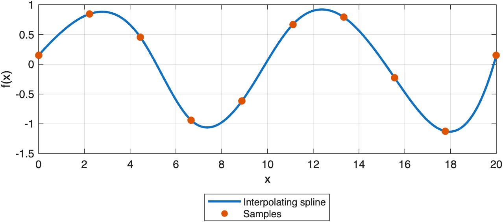
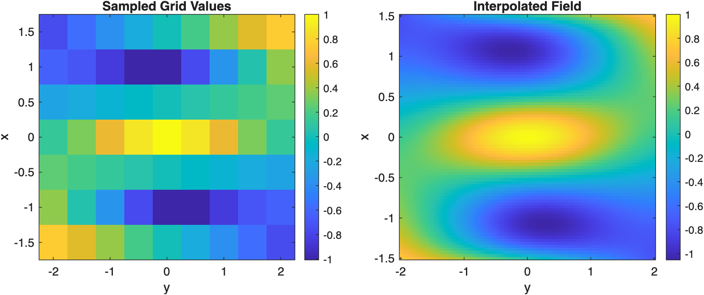
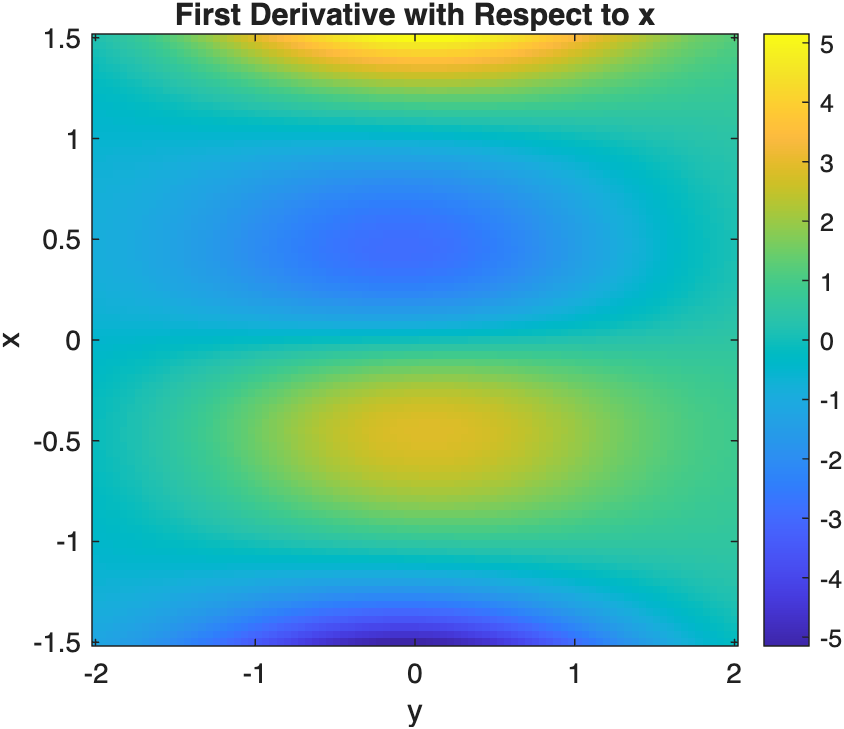

# Interpolating Spline Basics

Construct and evaluate one-dimensional and tensor-product interpolating splines.

Source: `Examples/Tutorials/InterpolatingSplineBasics.m`

## One-dimensional interpolation

Start with a smooth function sampled on a coarse grid. The
`InterpolatingSpline` constructor matches MATLAB's `griddedInterpolant`
style, so the data locations and values are the only required inputs.

```matlab
x = linspace(0, 20, 10)';
y = sin(2*pi*x/10) + 0.15*cos(2*pi*x/5);
xDense = linspace(min(x), max(x), 300)';

f = InterpolatingSpline(x, y, K=4);
yDense = f(xDense);

figure(Position=[100 100 720 320])
plot(xDense, yDense, "LineWidth", 2), hold on
scatter(x, y, 45, "filled")
xlabel("x")
ylabel("f(x)")
legend("Interpolating spline", "Samples", Location="southoutside")
grid on
```



*A cubic interpolating spline passes exactly through the sample points.*

## Tensor-product interpolation on a rectilinear grid

The same interface extends to higher dimensions. Pass one grid vector per
dimension followed by the array of values on the tensor grid.

```matlab
x = linspace(-1.5, 1.5, 7)';
y = linspace(-2, 2, 9)';
[X, Y] = ndgrid(x, y);
F = cos(pi*X).*exp(-0.5*Y.^2) + 0.25*X.*Y;

tensorSpline = InterpolatingSpline(x, y, F, K=[4 4]);

xq = linspace(min(x), max(x), 81)';
yq = linspace(min(y), max(y), 91)';
[Xq, Yq] = ndgrid(xq, yq);
Fq = tensorSpline(Xq, Yq);

figure(Position=[100 100 900 360])
tiledlayout(1, 2, TileSpacing="compact")

nexttile
imagesc(y, x, F)
axis xy
axis tight
colorbar
xlabel("y")
ylabel("x")
title("Sampled Grid Values")

nexttile
imagesc(yq, xq, Fq)
axis xy
axis tight
colorbar
xlabel("y")
ylabel("x")
title("Interpolated Field")
```



*A tensor-product interpolating spline evaluates naturally on a finer query grid.*

## Mixed partial derivatives

Mixed partials use the same call syntax with a derivative-order vector.
Here `[1 0]` means differentiate once with respect to the first
dimension and leave the second dimension untouched.

```matlab
dFdx = tensorSpline(Xq, Yq, [1 0]);

figure(Position=[100 100 460 360])
imagesc(yq, xq, dFdx)
axis xy
axis tight
colorbar
xlabel("y")
ylabel("x")
title("First Derivative with Respect to x")
```



*Derivative evaluation uses the same interpolant object and query syntax.*

