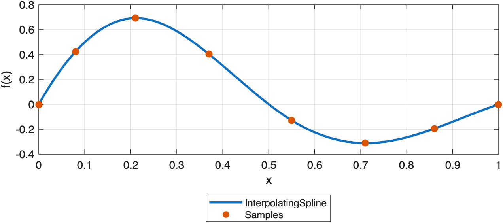
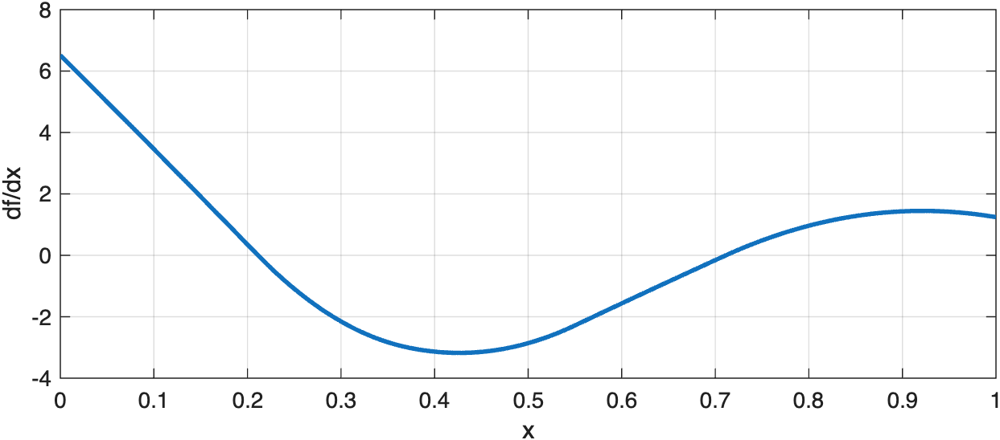
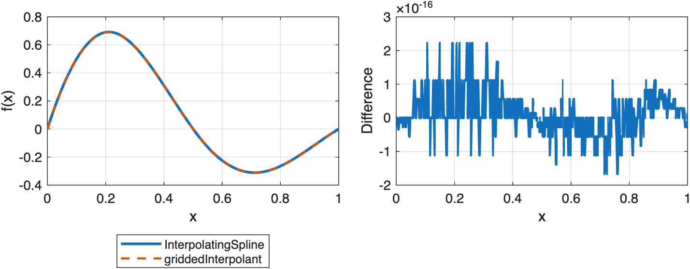
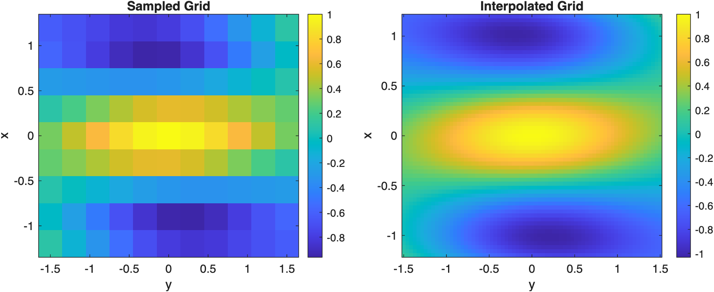
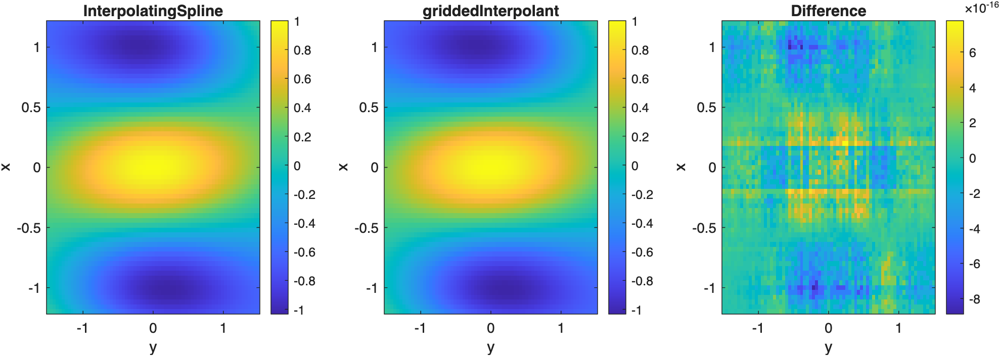

# Interpolation in 1D and on Rectilinear Grids

Interpolate exact data in one dimension and on rectilinear grids, and compare the results with MATLAB's griddedInterpolant.

Source: `Examples/Tutorials/InterpolationOnGrids.m`

## Interpolate exact samples in one dimension

`InterpolatingSpline` is the shortest path from exact samples to a
reusable spline object. Start with one irregular 1-D grid and evaluate
the interpolant on a denser set of query points.

```matlab
x = [0.00; 0.08; 0.21; 0.37; 0.55; 0.71; 0.86; 1.00];
y = exp(-1.6*x).*sin(2*pi*x);
xq = linspace(x(1), x(end), 400)';

spline1D = InterpolatingSpline(x, y, S=3);
yq = spline1D(xq);
```

Plot the interpolant against the original samples.

```matlab
figure(Position=[100 100 720 320])
plot(xq, yq, LineWidth=2), hold on
scatter(x, y, 42, "filled")
xlabel("x")
ylabel("f(x)")
legend("InterpolatingSpline", "Samples", Location="southoutside")
grid on
```



*A one-dimensional InterpolatingSpline passes exactly through the supplied samples and can be evaluated on a denser grid.*

## Differentiate the same interpolant

Derivative evaluation uses the same spline object. In 1-D, set `D=1` for
the first derivative, `D=2` for the second derivative, and so on.

```matlab
dyq = spline1D.valueAtPoints(xq, D=1);
```

Plot the derivative on the same dense query grid.

```matlab
figure(Position=[100 100 720 280])
plot(xq, dyq, LineWidth=2)
xlabel("x")
ylabel("df/dx")
grid on
```



*Derivative evaluation uses the same interpolant through valueAtPoints(..., D=1).*

## Compare the 1-D result with MATLAB

MATLAB's closest built-in analogue here is `griddedInterpolant`. The
values agree to machine precision, but `InterpolatingSpline` keeps the
same spline-object workflow that the package uses everywhere else.

```matlab
matlab1D = griddedInterpolant(x, y, "spline");
yqMatlab = matlab1D(xq);
```

Compare the two one-dimensional interpolants directly.

```matlab
figure(Position=[100 100 820 300])
tiledlayout(1, 2, TileSpacing="compact")

nexttile
plot(xq, yq, LineWidth=2), hold on
plot(xq, yqMatlab, "--", LineWidth=1.5)
xlabel("x")
ylabel("f(x)")
legend("InterpolatingSpline", "griddedInterpolant", Location="southoutside")
grid on

nexttile
plot(xq, yq - yqMatlab, LineWidth=2)
xlabel("x")
ylabel("Difference")
grid on
```



*InterpolatingSpline and MATLAB griddedInterpolant produce the same one-dimensional cubic interpolation on this grid.*

## Interpolate a rectilinear grid in two dimensions

The same constructor extends directly to tensor-product grids. Supply one
coordinate vector per dimension together with the array of grid values.

```matlab
xGrid = linspace(-1.2, 1.2, 9)';
yGrid = linspace(-1.5, 1.5, 11)';
[X, Y] = ndgrid(xGrid, yGrid);
F = cos(pi*X).*exp(-0.5*Y.^2) + 0.2*X.*Y;

xqGrid = linspace(xGrid(1), xGrid(end), 61)';
yqGrid = linspace(yGrid(1), yGrid(end), 71)';
[Xq, Yq] = ndgrid(xqGrid, yqGrid);

spline2D = InterpolatingSpline({xGrid, yGrid}, F, S=[3 3]);
Fq = spline2D(Xq, Yq);
```

Plot the sampled grid beside the interpolated field.

```matlab
figure(Position=[100 100 920 360])
tiledlayout(1, 2, TileSpacing="compact")

nexttile
imagesc(yGrid, xGrid, F)
axis xy
axis tight
colorbar
xlabel("y")
ylabel("x")
title("Sampled Grid")

nexttile
imagesc(yqGrid, xqGrid, Fq)
axis xy
axis tight
colorbar
xlabel("y")
ylabel("x")
title("Interpolated Grid")
```



*The same InterpolatingSpline workflow extends from one-dimensional data to rectilinear tensor grids.*

## Compare the 2-D result with MATLAB's griddedInterpolant

`griddedInterpolant` is also the natural MATLAB comparison in two
dimensions. Here both packages evaluate the same rectilinear-grid spline
on a finer query grid.

```matlab
matlab2D = griddedInterpolant({xGrid, yGrid}, F, "spline");
FqMatlab = matlab2D({xqGrid, yqGrid});
```

Compare the two rectilinear-grid interpolants and their difference.

```matlab
figure(Position=[100 100 1080 360])
tiledlayout(1, 3, TileSpacing="compact")

nexttile
imagesc(yqGrid, xqGrid, Fq)
axis xy
axis tight
colorbar
xlabel("y")
ylabel("x")
title("InterpolatingSpline")

nexttile
imagesc(yqGrid, xqGrid, FqMatlab)
axis xy
axis tight
colorbar
xlabel("y")
ylabel("x")
title("griddedInterpolant")

nexttile
imagesc(yqGrid, xqGrid, Fq - FqMatlab)
axis xy
axis tight
colorbar
xlabel("y")
ylabel("x")
title("Difference")
```



*InterpolatingSpline and MATLAB griddedInterpolant agree on the same rectilinear-grid interpolation problem.*

