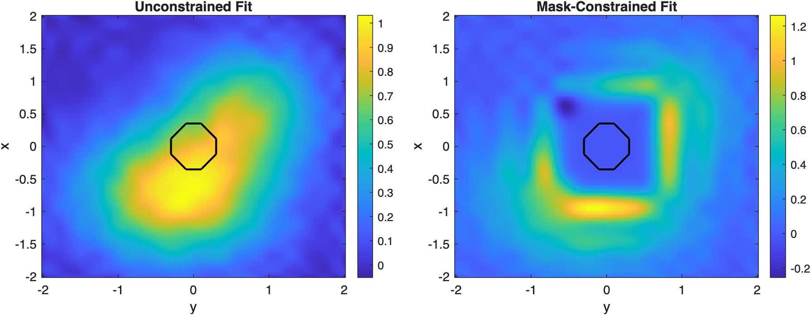
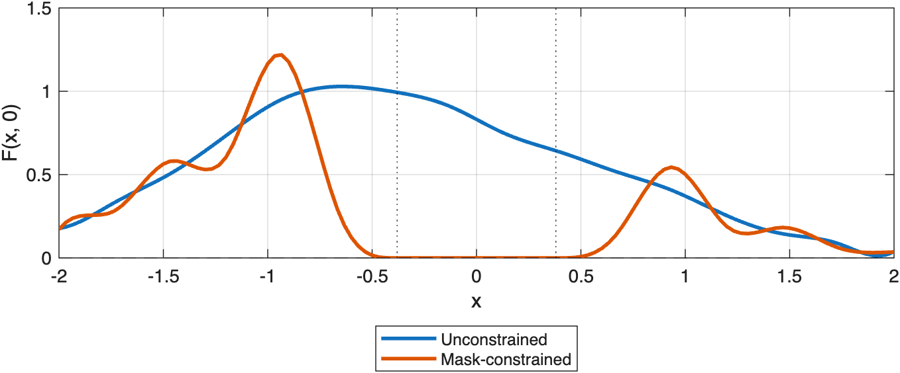

# Mask-Constrained Tensor Fits

Impose value and derivative constraints over an entire masked region using PointConstraint helper methods.

Source: `Examples/Tutorials/MaskConstrainedFit.m`

## Build a noisy 2D field with an island mask

`PointConstraint.equalOnMask` converts a logical mask into many local
constraints at once. This is useful when a region of the domain must obey
prescribed values or derivatives, such as setting an island interior to
zero in an ocean field.

```matlab
rng(12)
x = linspace(-2, 2, 35)';
y = linspace(-2, 2, 41)';
[X, Y] = ndgrid(x, y);

Ftrue = exp(-((X+0.7).^2 + 0.7*(Y+0.2).^2)) + ...
    0.65*exp(-1.2*((X-0.6).^2 + (Y-0.7).^2));
Fobs = Ftrue + 0.04*randn(size(Ftrue));

islandMask = (X.^2 + Y.^2) <= 0.38^2;
P = [X(:), Y(:)];
FobsVector = Fobs(:);

freeFit = ConstrainedSpline(P, FobsVector, K=[4 4], ...
    tKnot={linspace(min(x), max(x), 16)', linspace(min(y), max(y), 18)'});

maskedFit = ConstrainedSpline(P, FobsVector, K=[4 4], ...
    tKnot={linspace(min(x), max(x), 16)', linspace(min(y), max(y), 18)'}, ...
    constraints=[ ...
        PointConstraint.equalOnMask({x, y}, islandMask, D=[0 0], value=0)
        PointConstraint.equalOnMask({x, y}, islandMask, D=[1 0], value=0)
        PointConstraint.equalOnMask({x, y}, islandMask, D=[0 1], value=0)]);

xq = linspace(min(x), max(x), 121)';
yq = linspace(min(y), max(y), 131)';
[Xq, Yq] = ndgrid(xq, yq);
Ffree = freeFit(Xq, Yq);
Fmasked = maskedFit(Xq, Yq);

figure(Position=[100 100 980 360])
tiledlayout(1, 2, TileSpacing="compact")

nexttile
imagesc(yq, xq, Ffree)
axis xy
axis tight
colorbar
hold on
contour(y, x, islandMask, [1 1], "k", LineWidth=1.5)
xlabel("y")
ylabel("x")
title("Unconstrained Fit")

nexttile
imagesc(yq, xq, Fmasked)
axis xy
axis tight
colorbar
hold on
contour(y, x, islandMask, [1 1], "k", LineWidth=1.5)
xlabel("y")
ylabel("x")
title("Mask-Constrained Fit")
```



*Mask-based point constraints let one object impose many value and derivative conditions over a region.*

## Compare a transect through the masked region

A one-dimensional transect makes the local effect of the mask constraint
easier to see.

```matlab
midIndex = round(numel(yq)/2);

figure(Position=[100 100 780 320])
plot(xq, Ffree(:, midIndex), LineWidth=2), hold on
plot(xq, Fmasked(:, midIndex), LineWidth=2)
yline(0, "k--")
xline(-0.38, "k:")
xline(0.38, "k:")
xlabel("x")
ylabel("F(x, 0)")
legend("Unconstrained", "Mask-constrained", Location="southoutside")
grid on
```



*The constrained fit collapses smoothly toward zero across the masked island interior.*

