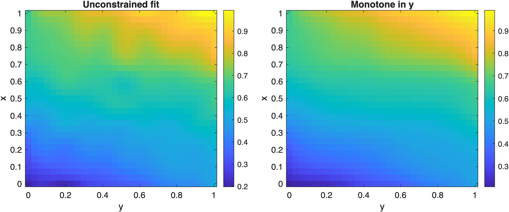
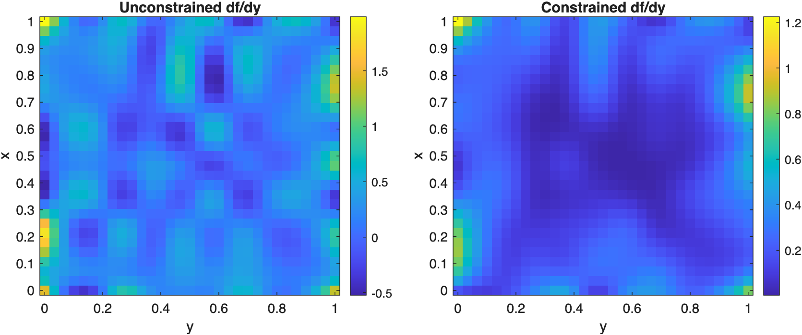

# 2D Constraints on Rectilinear Grids

Apply a global monotonicity constraint along one dimension of a noisy tensor-product fit.

Source: `Examples/Tutorials/RectilinearGridConstraints2D.m`

## Constrain one derivative direction on a rectilinear grid

The same constrained-fitting workflow extends to tensor-product grids.
Here the fit is required to increase with `y` everywhere on the domain:

$$
\frac{\partial f}{\partial y} \ge 0.
$$

```matlab
rng(1)
x = linspace(0, 1, 18)';
y = linspace(0, 1, 20)';
[X, Y] = ndgrid(x, y);
Ftrue = 0.2 + 0.5*X + 0.3*Y + 0.1*sin(pi*X).*cos(pi*Y);
Fobs = Ftrue + 0.03*randn(size(Ftrue));

noiseModel = NormalDistribution(0.03);
freeFit = ConstrainedSpline({x, y}, Fobs, S=[3 3], splineDOF=[10 10], distribution=noiseModel);
monotoneYFit = ConstrainedSpline({x, y}, Fobs, S=[3 3], splineDOF=[10 10], distribution=noiseModel, constraints=GlobalConstraint.monotonicIncreasing(dimension=2));

xq = linspace(x(1), x(end), 29)';
yq = linspace(y(1), y(end), 31)';
[Xq, Yq] = ndgrid(xq, yq);

Ffree = freeFit(Xq, Yq);
Fmonotone = monotoneYFit(Xq, Yq);
```

Plot the unconstrained and constrained tensor-product fits.

```matlab
figure(Position=[100 100 920 360])
tiledlayout(1, 2, TileSpacing="compact")

nexttile
imagesc(yq, xq, Ffree)
axis xy
axis tight
colorbar
xlabel("y")
ylabel("x")
title("Unconstrained fit")

nexttile
imagesc(yq, xq, Fmonotone)
axis xy
axis tight
colorbar
xlabel("y")
ylabel("x")
title("Monotone in y")
```



*A global monotonicity constraint can be enforced along one coordinate direction of a rectilinear-grid spline fit.*

## Check the derivative in the constrained direction

Evaluating `D=[0 1]` differentiates with respect to `y`. The constrained
fit keeps that derivative nonnegative throughout the query grid.

```matlab
dFdyFree = freeFit.valueAtPoints(Xq, Yq, D=[0 1]);
dFdyMonotone = monotoneYFit.valueAtPoints(Xq, Yq, D=[0 1]);
```

Plot the derivative in the constrained direction for both fits.

```matlab
figure(Position=[100 100 920 360])
tiledlayout(1, 2, TileSpacing="compact")

nexttile
imagesc(yq, xq, dFdyFree)
axis xy
axis tight
colorbar
xlabel("y")
ylabel("x")
title("Unconstrained df/dy")

nexttile
imagesc(yq, xq, dFdyMonotone)
axis xy
axis tight
colorbar
xlabel("y")
ylabel("x")
title("Constrained df/dy")
```



*The monotone-in-y fit keeps the y-derivative nonnegative across the full rectilinear grid.*

