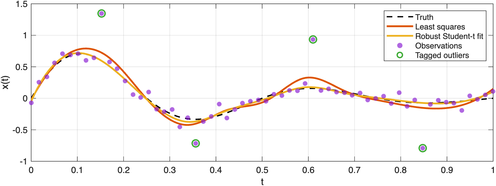
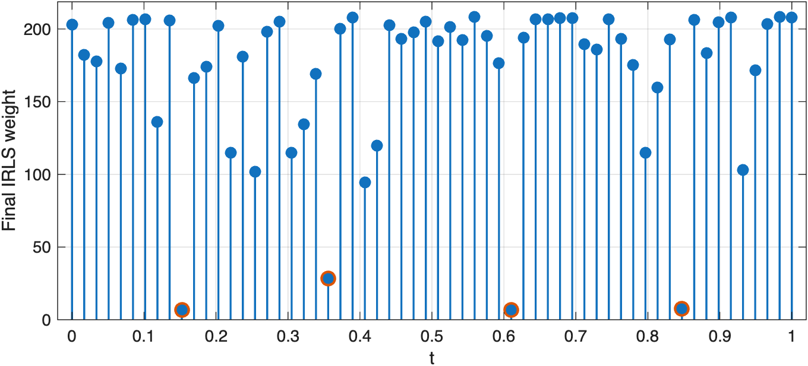

# Robust Fitting of Noisy Data

Compare ordinary least squares and Student-t IRLS when fitting a spline to noisy data with outliers.

Source: `Examples/Tutorials/RobustSplineFitting.m`

## Create noisy observations with outliers

`ConstrainedSpline` fits noisy data rather than interpolating it
exactly. By default the fit uses ordinary least squares. When a few
observations are corrupted by large outliers, a robust distribution can
downweight them automatically through iteratively reweighted least
squares.

In one dimension, `K=N` and `splineDOF=N` reproduce the same
least-squares polynomial fit as `polyfit(t,x,N-1)`. Here we choose a
larger spline basis with `dataDOF=5` so the fit can track more local
structure than a single cubic polynomial.

```matlab
rng(7)
t = linspace(0, 1, 60)';
xTrue = exp(-3*t).*sin(4*pi*t);
xObs = xTrue + 0.08*randn(size(t));
outlierIndex = [10 22 37 51];
xObs(outlierIndex) = xObs(outlierIndex) + [0.75; -0.55; 0.65; -0.7];

leastSquaresFit = ConstrainedSpline(t, xObs, K=4, dataDOF=5);
robustFit = ConstrainedSpline(t, xObs, K=4, dataDOF=5,  distribution=StudentTDistribution(sigma=0.08, nu=3));

tDense = linspace(min(t), max(t), 400)';
xTrueDense = exp(-3*tDense).*sin(4*pi*tDense);
xLeastSquares = leastSquaresFit(tDense);
xRobust = robustFit(tDense);

figure(Position=[100 100 900 300])
plot(tDense, xTrueDense, "k--", LineWidth=1.5), hold on
plot(tDense, xLeastSquares, LineWidth=2)
plot(tDense, xRobust, LineWidth=2)
scatter(t, xObs, 28, "filled", MarkerFaceAlpha=0.65)
scatter(t(outlierIndex), xObs(outlierIndex), 65, "o", LineWidth=1.5)
xlabel("t")
ylabel("x(t)")
legend("Truth", "Least squares", "Robust Student-t fit", "Observations", "Tagged outliers",  Location="northeast")
grid on
```



*A Student-t fit stays closer to the underlying signal when several observations are large outliers.*

## Inspect the final robust weights

The robust fit stores the final IRLS weights in the `W` property. Large
residuals receive smaller weights, so the outliers have less influence on
the fitted spline.

```matlab
figure(Position=[100 100 780 320])
stem(t, robustFit.W, "filled", LineWidth=1.2), hold on
scatter(t(outlierIndex), robustFit.W(outlierIndex), 65, "o", LineWidth=1.5)
xlabel("t")
ylabel("Final IRLS weight")
ylim([0, 1.05*max(robustFit.W)])
grid on
```



*The final IRLS weights reveal which observations were downweighted by the robust fit.*

