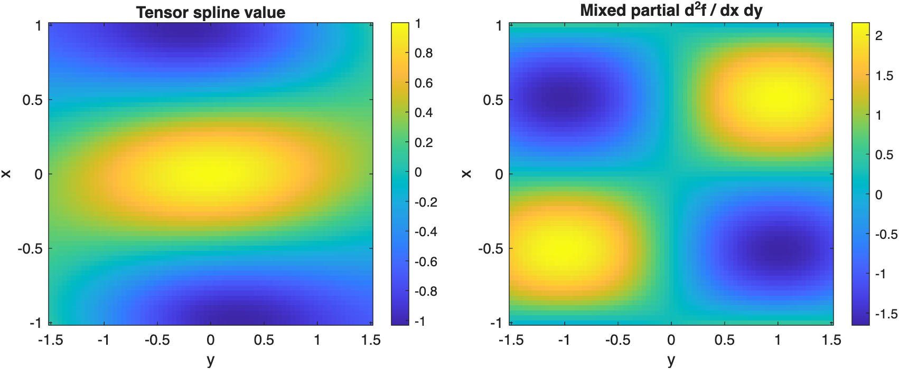
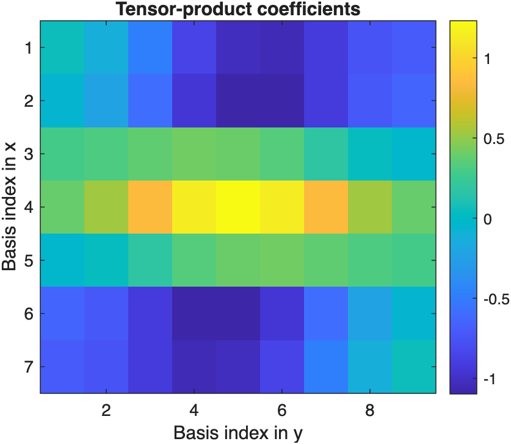

# TensorSpline Foundations

Understand tensor-product spline coefficients, basis matrices, and mixed partial derivatives.

Source: `Examples/Tutorials/TensorSplineFoundations.m`

## Build a tensor-product basis from grid vectors

The low-level multidimensional spline model is

$$
f(x_1,\ldots,x_d)=\sum_{j_1,\ldots,j_d}\xi_{j_1,\ldots,j_d}\prod_{k=1}^{d} B_{j_k,S_k}(x_k;\tau_k).
$$

In practice that means building one knot vector per dimension, turning a
rectilinear grid into a point matrix, and then assembling the tensor
basis with `TensorSpline.matrixForPointMatrix`.

```matlab
x = linspace(-1, 1, 7)';
y = linspace(-1.5, 1.5, 9)';
knotPoints = { ...
    BSpline.knotPointsForDataPoints(x, S=3)
    BSpline.knotPointsForDataPoints(y, S=3)};

pointMatrix = TensorSpline.pointsFromGridVectors({x, y});
values = cos(pi*pointMatrix(:,1)).*exp(-0.5*pointMatrix(:,2).^2) + 0.25*pointMatrix(:,1).*pointMatrix(:,2);
basisMatrix = TensorSpline.matrixForPointMatrix(pointMatrix, knotPoints=knotPoints, S=[3 3]);
xi = basisMatrix \ values;

tensorSpline = TensorSpline(S=[3 3], knotPoints=knotPoints, xi=xi);
```

## Evaluate the tensor spline and a mixed partial derivative

Tensor-product coefficients are stored in the shape implied by the basis.
Evaluation still uses one query array per dimension, and mixed partials
are chosen with one derivative order per dimension:

$$
\frac{\partial^2 f}{\partial x \,\partial y}.
$$

```matlab
xq = linspace(x(1), x(end), 61)';
yq = linspace(y(1), y(end), 71)';
[Xq, Yq] = ndgrid(xq, yq);

Fq = tensorSpline(Xq, Yq);
d2F = tensorSpline.valueAtPoints(Xq, Yq, D=[1 1]);
```

Plot the tensor-product field and the mixed partial on the same grid.

```matlab
figure(Position=[100 100 920 360])
tiledlayout(1, 2, TileSpacing="compact")

nexttile
imagesc(yq, xq, Fq)
axis xy
axis tight
colorbar
xlabel("y")
ylabel("x")
title("Tensor spline value")

nexttile
imagesc(yq, xq, d2F)
axis xy
axis tight
colorbar
xlabel("y")
ylabel("x")
title("Mixed partial d^2f / dx dy")
```



*TensorSpline evaluates the tensor-product field and its mixed partial derivatives on matching query arrays.*

## Inspect the coefficient array shape

In two dimensions, `xi` is naturally stored as a matrix whose size
matches `basisSize`. That layout is what makes the tensor-product
interpretation concrete.

```matlab
basisSize = tensorSpline.basisSize;
coefficientArray = tensorSpline.xi;
```

Plot the tensor-product coefficients in their natural two-dimensional layout.

```matlab
figure(Position=[100 100 460 360])
imagesc(coefficientArray)
axis tight
colorbar
xlabel("Basis index in y")
ylabel("Basis index in x")
title("Tensor-product coefficients")
```



*The tensor-product coefficients are stored in the same multidimensional layout as the basis itself.*

